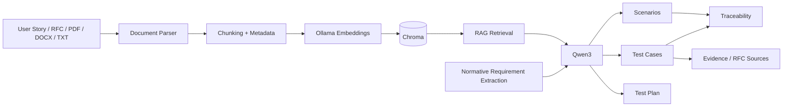

# TestGenAI — AI-Powered Network TestOps

TestGenAI is a document-grounded GenAI platform for network and protocol test engineering.
It turns user stories, acceptance criteria, RFCs and technical documents into traceable test scenarios, detailed test cases and test plans using local RAG and an LLM.

> **Current release:** v0.1.0 — RAG-Grounded Network TestOps POC

## Why this project

Generic LLM test generators can produce plausible-looking tests without understanding protocol requirements. TestGenAI is designed around network engineering evidence: RFCs, specifications, requirements and test documents are indexed and retrieved before test generation.

## Current workflow



## Current capabilities

- User Story / Requirements mode
- Document / RFC mode
- Hybrid mode
- PDF, DOCX, TXT and Markdown ingestion
- Persistent local Chroma knowledge base
- Ollama embeddings
- Local Qwen3 generation
- Semantic retrieval with source references
- Deterministic extraction of normative statements such as MUST, MUST NOT, SHOULD, SHOULD NOT and MAY
- Document requirement IDs such as `REQ-RFC4271-001`
- Document-driven scenarios
- Document-driven test cases
- Document-driven test plans
- Test-case evidence references
- Traceability and acceptance-criteria coverage
- Optional test topology supplied by the user
- Null-safe LLM output normalization
- Batched Ollama embedding with retries for local CPU environments

## Example

A user can upload an RFC such as `rfc4271.txt` and select **Document / RFC** mode.

The platform extracts source-grounded normative requirements, retrieves relevant RFC chunks, and asks Qwen3 to generate protocol-specific test coverage.

The generated test case can link:

```text
RFC / source section
       ↓
REQ-RFC4271-xxx
       ↓
Scenario
       ↓
TC-xxx
       ↓
Evidence: SOURCE-x
```

## Technology

- Python
- Streamlit
- Pydantic
- Ollama
- Qwen3
- ChromaDB
- RAG / semantic retrieval
- pypdf
- python-docx

## Local setup

### 1. Start Ollama

Make sure Ollama is installed and running, then pull the models:

```bash
ollama pull qwen3:4b
ollama pull embeddinggemma
```

### 2. Create and activate a virtual environment

Git Bash on Windows:

```bash
python -m venv .venv
source .venv/Scripts/activate
```

### 3. Install dependencies

```bash
pip install -r requirements.txt
```

### 4. Run

```bash
streamlit run app.py
```

### Optional embedding tuning

For local CPU machines, embedding batches can be reduced:

```bash
export TESTGENAI_EMBED_BATCH=4
export TESTGENAI_EMBED_RETRIES=3
```

Defaults are already conservative.

## Recommended demo flow

1. Upload an RFC or technical document.
2. Click **Index Documents**.
3. Select the document under **Documents to analyze**.
4. Click **Analyze Documents**.
5. Review extracted normative requirements.
6. Select **Document / RFC** or **Hybrid** mode.
7. Select test types.
8. Optionally provide a test topology.
9. Click **Generate Document-Driven Test Suite**.
10. Review Document Requirements, Scenarios, Test Cases, Test Plan, Traceability and Sources.

## Architecture principles

### Ground the LLM

The LLM receives the user requirements, extracted document requirements and retrieved evidence. It is instructed not to invent protocol behavior, vendor commands, timers, limits or error codes that are not supported by the supplied evidence.

### Keep deterministic checks outside the LLM

Python handles structural validation, IDs, evidence filtering, traceability and coverage calculations. The LLM is used for language understanding and test design rather than being the source of truth for coverage metrics.

### Do not invent topology

Topology is optional. If it is not supplied or supported by evidence, the UI reports it as unspecified instead of allowing the model to fabricate a lab topology.

## Roadmap

### v0.2 — Phase 7: Test Automation

- Generate pytest test skeletons from approved test cases
- Protocol-aware automation templates
- Test-data/config generation
- Automation review and validation

### v0.3 — Network Testbed Execution

- Connect generated tests to network testbeds
- Collect execution logs and packet/test evidence
- Store test results

### v0.4 — AI Failure Analysis

- Log/error summarization
- Failure classification
- Likely root-cause evidence
- Suggested troubleshooting steps

### v0.5 — MLOps / Cloud

- CI/CD
- AWS deployment
- Model/evaluation tracking
- Observability
- Evaluation datasets and regression tests

## Project status

This repository is a working portfolio POC, not a production network testing product. The architecture is intentionally evolving toward an end-to-end Network TestOps workflow.

## License

For portfolio/demo use. Add a project-specific open-source license before distributing the repository as an open-source project.
