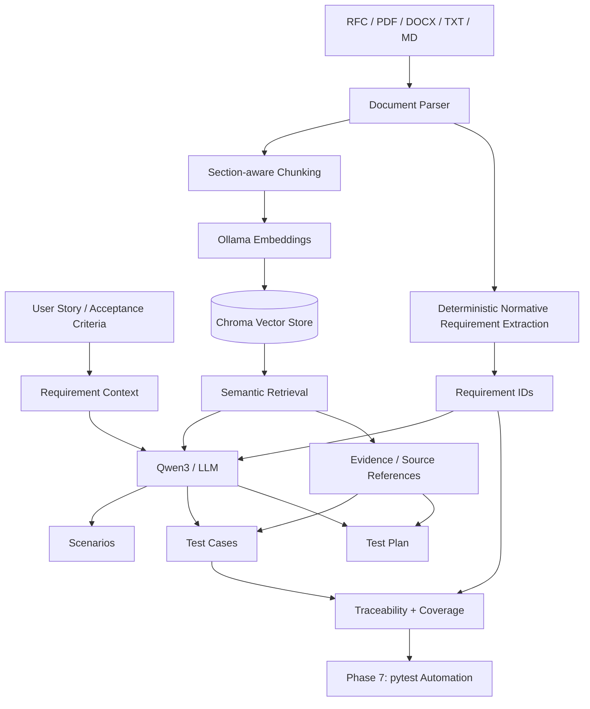

# TestGenAI Architecture

## Design boundary

**LLM responsibilities:**
- interpret requirements
- synthesize scenarios
- design test cases
- produce test-plan prose

**Deterministic application responsibilities:**
- document parsing
- normative keyword extraction
- requirement IDs
- evidence-reference filtering
- structural validation
- traceability
- coverage calculations
- null/blank output cleanup

This boundary is intentional: the LLM is used for generation while measurable QA bookkeeping remains deterministic.
